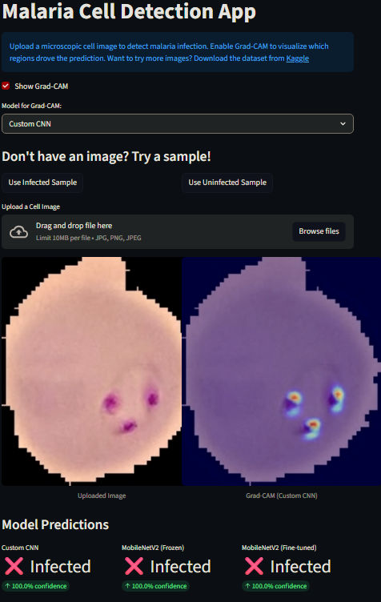
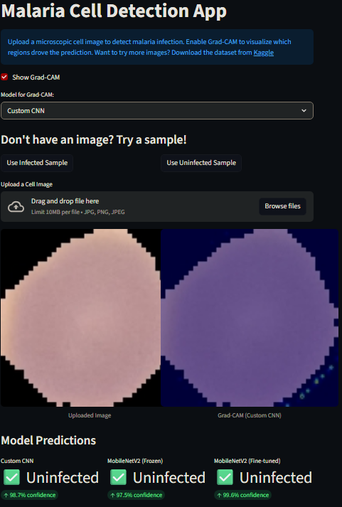

# 🦠 Malaria Cell Detection App

A deep learning web application built with **Streamlit** that classifies microscopic cell images as **Infected** or **Uninfected** using multiple models, with optional **Grad-CAM visualization** for interpretability.

---

## 🚀 Live Demo

[](https://malaria-cell-classifier.streamlit.app/)

👉 **[https://malaria-cell-classifier.streamlit.app/](https://malaria-cell-classifier.streamlit.app/)**

---

## 📌 Features

* 🧠 **Multiple Model Comparison**
  * Custom CNN
  * MobileNetV2 (Frozen)
  * MobileNetV2 (Fine-tuned)
* 📊 **Confidence Scores**
  * Displays prediction confidence for each model
* 🔍 **Grad-CAM Visualization**
  * Highlights regions of the image most important for model decisions
* 🖼️ **Image Upload Support**
  * Upload `.jpg`, `.png`, or `.jpeg` cell images
* 🧪 **Built-in Sample Images**
  * Try an infected or uninfected sample without uploading your own

---

## 🧪 How It Works

1. Upload a microscopic cell image — or use a built-in sample
2. The app preprocesses the image
3. Each model makes a prediction
4. Results are displayed side-by-side with confidence scores
5. (Optional) Select a model and enable Grad-CAM to visualize what drove the prediction

---

## 🛠️ Tech Stack

* **Frontend/UI:** Streamlit
* **Deep Learning:** TensorFlow / Keras
* **Visualization:** Matplotlib (Grad-CAM heatmaps)
* **Model Hosting:** Hugging Face Hub ('DanLDevs/malaria-cell-detection')
* **Deployment:** Streamlit Community Cloud

---

## 📂 Project Structure

```
malaria-streamlit-app/
│
├── .devcontainer/
│   └── devcontainer.json      # Dev container configuration
├── .streamlit/
│   └── config.toml            # Streamlit app configuration
├── assets/
│   ├── infected_example.png   # README screenshot assets
│   └── uninfected_example.png
├── samples/
│   ├── infected_sample.png    # In-app sample images
│   └── uninfected_sample.png
├── .gitignore
├── .python-version            # Python version pin
├── app.py                     # Main Streamlit application
├── requirements.txt           # Dependencies
├── runtime.txt                # Python runtime for deployment
└── README.md                  # Project documentation
```

---

## ⚙️ Installation (Run Locally)

### 1. Clone the repository

```
git clone https://github.com/yourusername/malaria-streamlit-app.git
cd malaria-streamlit-app
```

### 2. Install dependencies

```
pip install -r requirements.txt
```

### 3. Run the app

``` bash
streamlit run app.py
```

---

## ⏳ Notes

* Model weights are automatically downloaded on first run from [Hugging Face]([https://huggingface](https://huggingface.co/DanLDevs/malaria-cell-detection)
* The hosted app loads quickly — no warm-up wait required

---

## 🔗 Related Project

Full model training, experimentation, and notebooks:
👉 [https://github.com/MaryvilleUniversity-AI/malaria-image-classification](https://github.com/MaryvilleUniversity-AI/malaria-image-classification)

---

## 📸 Screenshots




---

## 💡 Future Improvements

* Add more model architectures
* Improve UI/UX design
* Add batch image processing
* Deploy with Docker

---

## 👤 Author

MaryvilleUniversity-AI
GitHub: [https://github.com/MaryvilleUniversity-AI](https://github.com/MaryvilleUniversity-AI)

---

## ⭐ Acknowledgments

* Dataset: NIH Malaria Dataset
* Inspiration: Medical imaging and AI interpretability research
